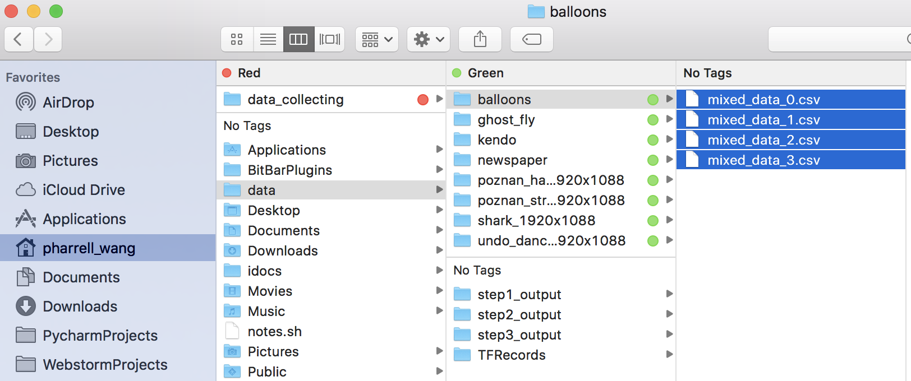
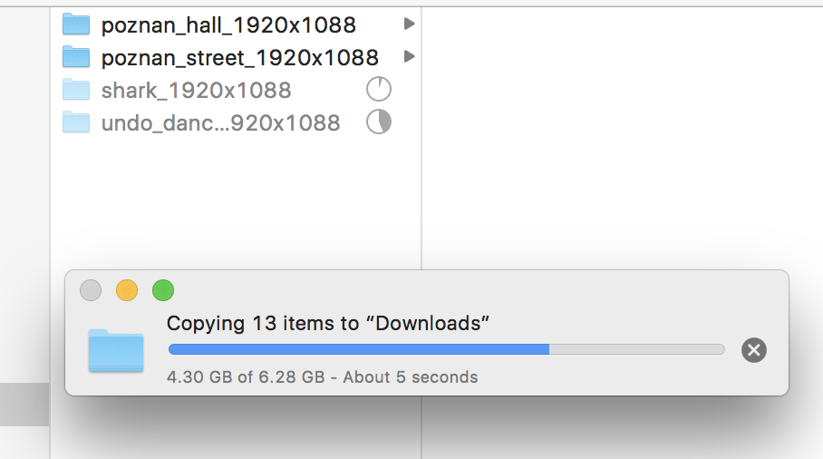
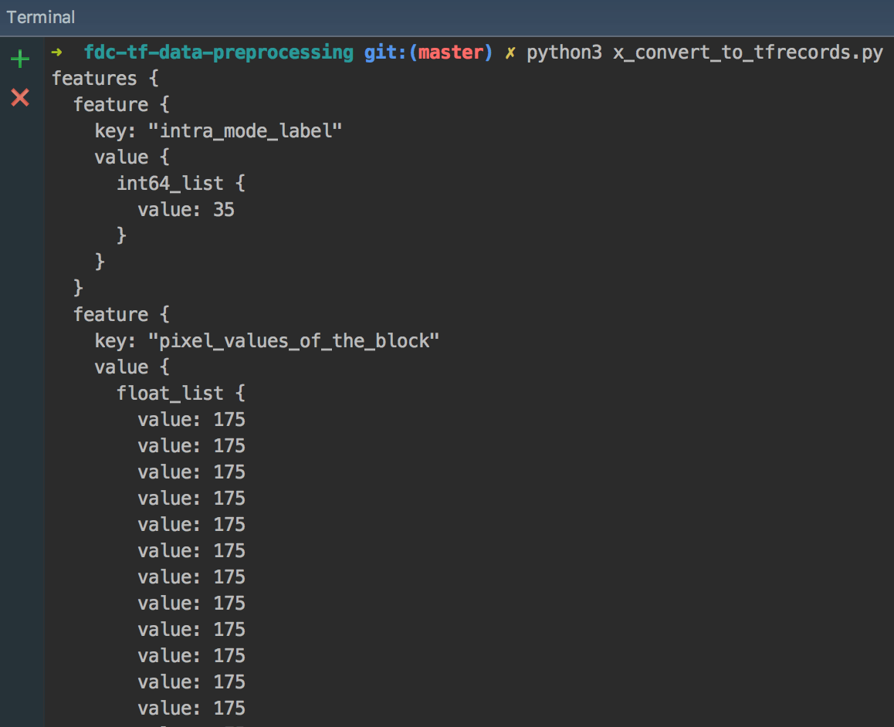
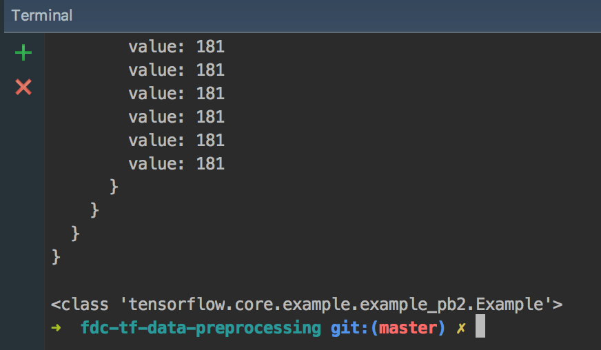

Data Collection
===============

This document will show you how to collect the data for *fast depth coding using deep learning*.

Data Source
-----------
**We collect the data by encoding the video sequences.**

Data are collected from four video sequences.

   +----+-------------------------+
   | #  | name of the sequence    |
   +====+=========================+
   | 1  | poznan_hall_1920x1088   |
   +----+-------------------------+
   | 2  | poznan_street_1920x1088 |
   +----+-------------------------+
   | 3  | shark_1920x1088         |
   +----+-------------------------+
   | 4  | undo_dancer_1920x1088   |
   +----+-------------------------+

Path of collected data
----------------------
``/Volumes/XssdPharrell/data_collecting/``

   A screen capture of the data path.

Size of collected data
----------------------
Size of collected data: 6.28 GB

   A screen capture of the data size.

In the picture above, the four folders only contain ``/data_exported`` folders. All the other files (including video sequences, codec binaries and scripts) are removed for showing *the size of the data*.

.. _effort-from-ho:

Effort from Ho
--------------

The pdf file created by Ho are provided for downloading.

:download:`20170621 Fast Depth Coding Via TensorFlow (Data Collection) v1 <pdf_files/effort_ho.pdf>`

Effort from me
--------------

.. _dc-modifications:

Modifications
~~~~~~~~~~~~~
Based on the :ref:`effort-from-ho`, I made some modifications to better
facilitate the *model training process*.

When encoding the video sequences, for every block:

- ``if`` DIS has been assigned (where ``DIS_FLAG == 1``), we **skip** it (since none of the conventional intra modes including DMMs will be used). *Skip it* means we don't collect data from it.
- ``else if`` DIS has **not** been assigned (where ``DIS_FLAG == 0``), let's identify the partition mode:

    - ``if`` HTM encoder decides to implement a partition for the block (where ``partition_number == 4`` (NXN)):

        - SKIP it.

    - ``else if`` HTM encoder decides **not** to implement a partition:

        - let's **collect** the ``INTRA_PRED[0]`` along with the **1-D Depth Data**.

.. note::

      1. **1-D Depth Data** means the pixel value of the depth block being **flattened** into 1 dimension. For example, to store an M x N matrix of pixel values (you can imagine those pixels forming an image, hence it is like we are storing an image), the **1-D Depth Data** (pixel values) must contain M*N values, with M rows of N contiguous values each.  That is, the 1-D data must store the matrix as: ``.... row 0 .... .... row 1 .... // ...........  // ... row M-1 ....``

      2. when collecting the data, I have made it to write 35 for mode 37, and 36 for mode 38. Hence a little time/energy is saved for the data processing.

Project
~~~~~~~

About the Project
^^^^^^^^^^^^^^^^^

Based on the above ideas, I have created a project in Python for pre processing the data.

Anyone can clone the codebase of the project from GitHub. You can view the codes after you obtained your copy.

:Date: 2017-08-17
:Version: 0.1.0
:Author: Pharrell.zx WANG
:Name: **data-processing-for-fdc**
:GitHub: `data-processing-for-fast-depth-coding <https://github.com/PharrellWANG/data-processing-for-fdc>`_.
:License: `MIT License <https://choosealicense.com/licenses/mit/>`_.

Behaviours of the Project
^^^^^^^^^^^^^^^^^^^^^^^^^
For pre-processing the data, we need to go through the steps below:

**step 1** Concatenate the data sets according to block sizes (e.g., According to block sizes, concat the data from difference sequences into four groups/csv_files, 64x64, 32x32, 16x16, 8x8)

**step 2** Remove the commas at the end of each line for all the four csv_files.

**step 3** Counting the total number of data samples, and use the counting results to divide the data into 3 sets. See the table below.

   +-------------------------+-------------+
   | **Training** data set   |     60%     |
   +-------------------------+-------------+
   | **Validation** data set |     20%     |
   +-------------------------+-------------+
   | **Testing** data set    |     20%     |
   +-------------------------+-------------+

.. note::

        1. Those ratios are recommended by `Andrew Ng <http://www.andrewng.org/about/>`_. You'd be surprised to find out that 80/20 is quite a commonly occurring ratio, often referred to as the Pareto principle. It's usually a safe bet if you use that ratio.

        2. To be fair, we will first find the class [from the 37 classes] which has the least data samples, secondly based on its amount of samples, we get the train-validation-test data sets for other classes such that all classes have the same amount of data for the deep learning.

**step 4** Convert data to **TFRecord** format. (The recommended format for TensorFlow is a `TFRecord <https://www.tensorflow.org/versions/r1.1/api_guides/python/python_io#tfrecords_format_details>`_ file containing `tf.train.Example protocol buffers <https://github.com/tensorflow/tensorflow/blob/r1.1/tensorflow/core/example/example.proto>`_ (which contain Features as a field). )

See two pictures below for reference.

   A screen capture of our TFRecord 1

   A screen capture of our TFRecord 2

.. note::
      1. In the two pictures above, the names of the project and file belong to the old project. Now for publishing the project I have restructured/reformatted some files.
      2. The two pictures above only serve for demonstrating the structure of the TFRecord before they are serialized to string.

There's the other functionality of the project -- :ref:`data-visu`.
