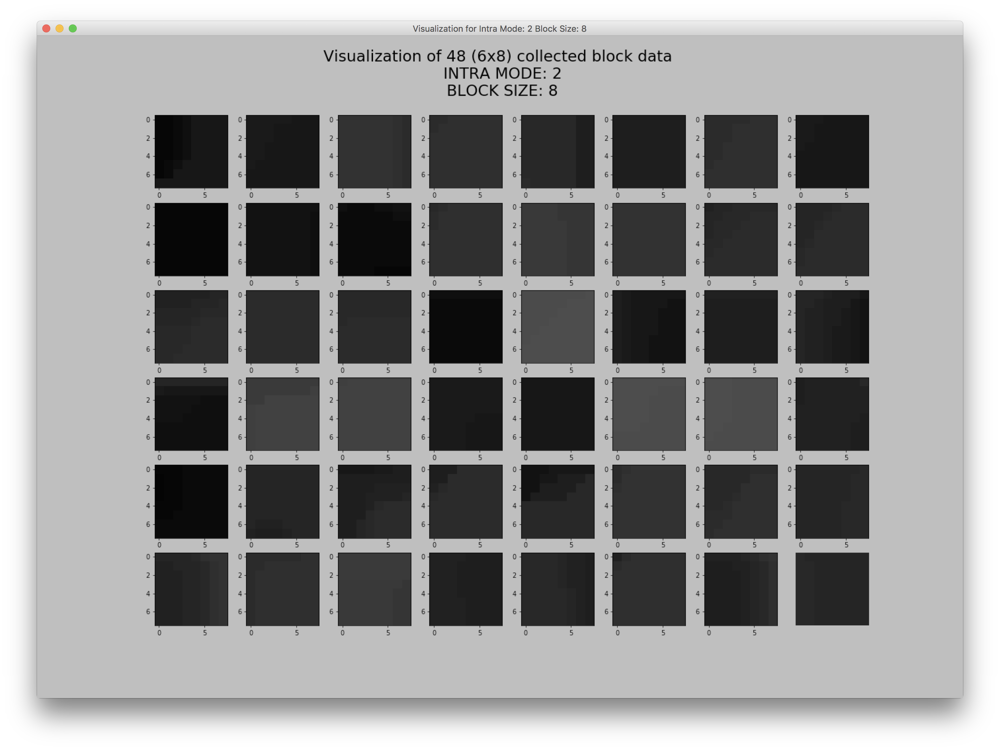
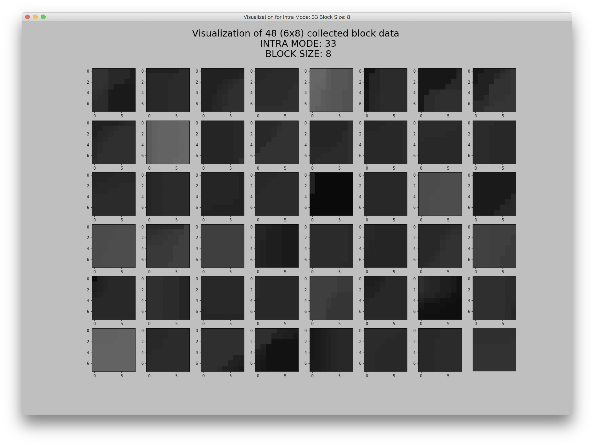
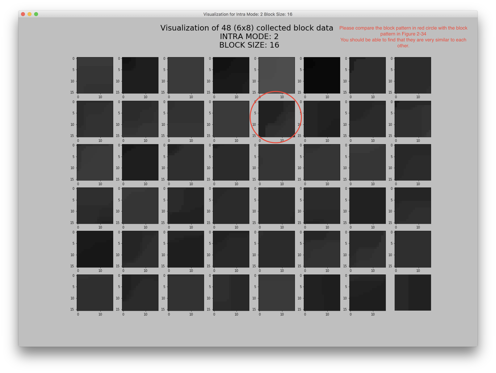

.. _data-visu:

Data Visualization
==================
``Figure 0-1`` and ``Figure 0-2`` are **the illustrations of Intra modes in HEVC** in case you want to refresh your memory. (DMMs are not illustrated here).

Other figures are **the visualization of some collected data**, since putting all the visualization images here would be possibly overwhelming and unnecessary.

.. note::  But if you want to see all the visualization images, that is also doable, please just let me know :D

.. important::
   Please compare ``Figure 2-2`` with ``Figure 2-34``. Compare the two blocks in red circle. You should be able to find the patterns are very similar to each other while their modes are totally different. This is the reason why we need to use TOP-5 accuracy instead of TOP-1 for evaluating the machine learning model.

   .. glossary::

   TOP-5
      To compare models, we examine how often the model fails to predict the correct answer as one of their top 5 guesses -- termed "top-5 error rate".

.. how to use term: ======>>> :term: asdf; asdfasd

Intra modes in HEVC
-------------------

   Figure 0-1. Illustration of Intra modes [0, 34]

   Figure 0-2. Examples of 8x8 luma prediction blocks generated with all the HEVC intra prediction modes.

Examples for block size 8x8
---------------------------

   Figure 1-0. Intra Mode: 0, Block Size: 8x8

   Figure 1-1. Intra Mode: 1, Block Size: 8x8

   Figure 1-2. Intra Mode: 2, Block Size: 8x8

   Figure 1-3. Intra Mode: 3, Block Size: 8x8

   Figure 1-4. Intra Mode: 4, Block Size: 8x8

   Figure 1-5. Intra Mode: 5, Block Size: 8x8

   Figure 1-6. Intra Mode: 6, Block Size: 8x8

   Figure 1-7. Intra Mode: 7, Block Size: 8x8

   Figure 1-33. Intra Mode: 33, Block Size: 8x8

   Figure 1-35. Intra Mode: 35, Block Size: 8x8

   Figure 1-36. Intra Mode: 36, Block Size: 8x8

Examples for block size 16x16
-----------------------------

   Figure 2-0. Intra Mode: 0, Block Size: 16x16

   Figure 2-1. Intra Mode: 1, Block Size: 16x16

   Figure 2-2. Intra Mode: 2, Block Size: 16x16

   Figure 2-3. Intra Mode: 3, Block Size: 16x16

   Figure 2-34. Intra Mode: 34, Block Size: 16x16
