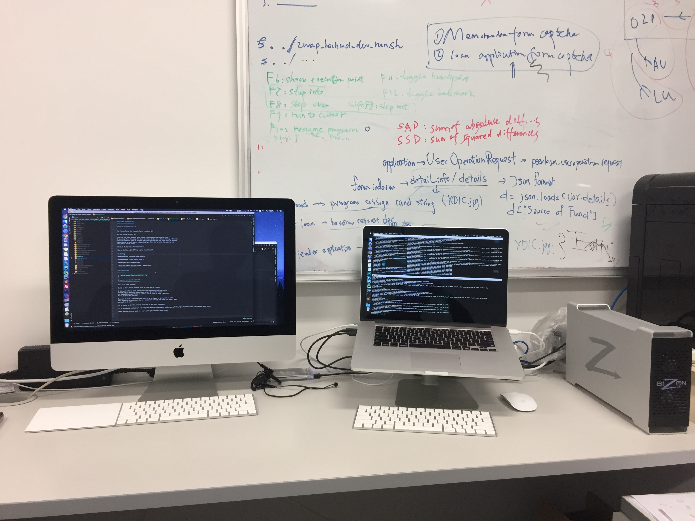

HTM Codec Integration
=====================

Run the inference in C++
------------------------

Downloading the codebase from GitHub: https://github.com/PharrellWANG/Run-Inference-in-Cpp

- Newest stable version of Tensorflow: 1.3

- Version 1.1 is used in this work.

- Tensorflow r1.1 is the last version that Tensorflow supports Mac GPU.

- Windows OS is terrible for Tensorflow.

- Ubuntu desktop with GPU is highly recommended.

Devices
~~~~~~~

    Devices for this project

Device for Data Processing
^^^^^^^^^^^^^^^^^^^^^^^^^^
- **iMac (21.5-inch 2017)**
- Processor 3GHz Intel Core i5
- Memory 8GB 2400 MHz DDR4

Device for Training Models
^^^^^^^^^^^^^^^^^^^^^^^^^^
- **Macbook Pro (15-inch, Mid 2015)**
- Processor 2.2GHz Intel Core i7
- Memory 16GB 1600MHz DDR3
- Nvidia GTX980, Memory 4GB (External GPU)

Pre-requisites
~~~~~~~~~~~~~~

1. `Build tensorflow from source <https://www.tensorflow.org/versions/r1.1/install/install_sources>`_

2. `Build shared library for using the TensorFlow C++ library <https://github.com/FloopCZ/tensorflow_cc>`_

3. `CMake <https://cmake.org/>`_

Integrate the model into HTM
----------------------------

This is a Todo section.

Shall be done after meeting.

I think it will be much better for the proposed algorithm to be
theoretically admitted by Dr.Chan before I run the codec
for PSNR/BD Rate performance.

Besides, I wish i can have some help from Dr.Tsang to implement it into
fast wedgelet prediction. The C++ codes for running the model is ready. What
we need to do are

1. to place it in the correct position in HTM 16.2 codebase.

2. to discuss a method for reducing the wedgelet candidates making use of the angular predictions from learned deep model.

Thank you for reading.

