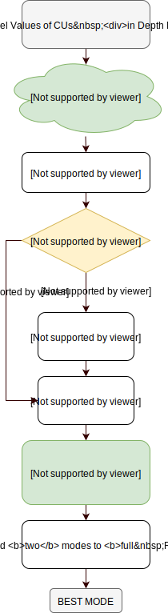
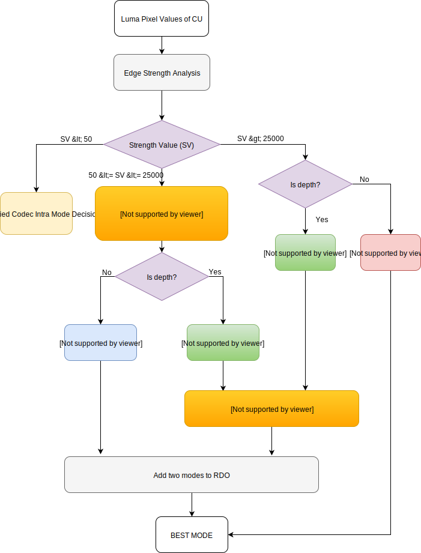

Proposed Algorithm
==================

In 3D-HEVC, the wedgelet searching process in the depth map coding consumes a
lot of time. We propose an algorithm in this work to balance the
trade-off between **coding efficiency** and **computational complexity**
using deep learning.

Flow Chart
----------

   Figure 1: Flowchart for Proposed Algorithm

Description
-----------

``step 1`` Get the Luma pixel values from one depth block.
(The block can be of size 8x8, 16x16, 32x32)

``step 2`` Feed the 2D matrix of Luma pixels into **learned model** for
getting the **top-16 predictions**.

``step 3`` Add **top 16 predictions** into the **RMD LIST**.

``step 4`` Check whether mode 2 is inside **RMD LIST**. If yes, add mode 34 into
**RMD LIST**; otherwise jump to *step 5*.

``step 5`` Add mode 0, 1, DMM1, DMM4 into **RMD LIST**.

``step 6`` ``Do RMD``. For DMM1, only check the directions covered by
**top-16 predictions**.

``step 7`` Add two modes into **FULL RDO LIST**. ``Do full RDO``.

``step 8`` Obtain the **best mode** for the depth block.

.. note:: The above process can be applied to a batch of blocks, in which case
            the time cost of prediction can be optimized.
            For details, see :ref:`Time-Cost-Analysis`

[Deprecated]Flow chart
----------------------

This chart has been deprecated. Kept here only for reference.

**Deprecation Summary**

- For below ``reason 1`` and ``reason 2``, we remove **edge strength analysis**;
- For below ``reason 3``, we remove **the implementation to texture**.

**Reasons**

1. Edge strength analysis is not innovative.
2. Besides, removing it from the flow chart only will decrease the accuracy of ResNet prediction by roughly 2%~3%.
3. And according to **Dr.Tsang**, since we are only using luma pixel values, it seems we should not apply our model into the texture blocks.

   Figure D-1: Flowchart for Proposed Fast Intra Mode Decision Algorithm