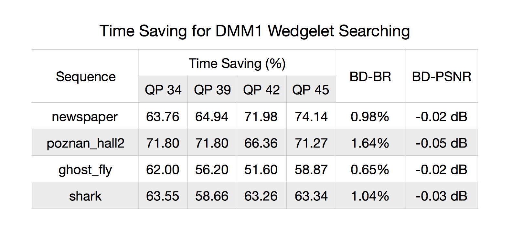
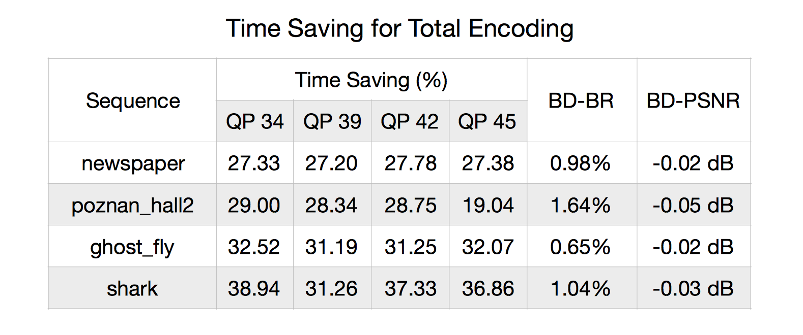

Simulation Results
==================

We have integrated the learned ResNet model into ``HTM16.2`` (which is
the reference software of 3D-HEVC).

Several simulations are carried out to further evaluate the
performance of the proposed algorithm.

**BD-BR** and **BD-PSNR** metrics [REF2]_ are employed.

Simulation Environments
-----------------------
Device
~~~~~~
- **Macbook Pro (15-inch, Mid 2015)**
- Processor 2.2GHz Intel Core i7
- Memory 16GB 1600MHz DDR3
- Nvidia GTX980, Memory 4GB (External GPU)

Video Sequences
~~~~~~~~~~~~~~~

Data are collected from four video sequences.

(This table is copied from :ref:`data-collected-four-seqs`)

   +----+------------------------+------------+-----------------------+--------+
   | #  | Name of the Sequence   | Resolution | Usage                 | Frames |
   +====+========================+============+=======================+========+
   | 1  | Balloons               |1024x768    | train/test/validation | 300    |
   +----+------------------------+------------+-----------------------+--------+
   | 2  | Kendo                  |1024x768    | train/test/validation | 300    |
   +----+------------------------+------------+-----------------------+--------+
   | 3  | PoznanStreet           |1920x1088   | train/test/validation | 250    |
   +----+------------------------+------------+-----------------------+--------+
   | 4  | UndoDancer             |1920x1088   | train/test/validation | 250    |
   +----+------------------------+------------+-----------------------+--------+

We want to make sure every sample that will be predicted has never been seen
by the learned model. Otherwise it will be cheating.

Anther four sequences which have never been seen by the learned ResNet model
are used for simulation:

   +----+------------------------+------------+-----------------------+--------+
   | #  | Name of the Sequence   | Resolution | Usage                 | Frames |
   +====+========================+============+=======================+========+
   | 1  | Newspaper              |1024x768    | Simulation            | 300    |
   +----+------------------------+------------+-----------------------+--------+
   | 2  | GhostTownFly           |1920x1088   | Simulation            | 250    |
   +----+------------------------+------------+-----------------------+--------+
   | 3  | PoznanHall2            |1920x1088   | Simulation            | 200    |
   +----+------------------------+------------+-----------------------+--------+
   | 4  | Shark                  |1920x1088   | Simulation            | 300    |
   +----+------------------------+------------+-----------------------+--------+

Configuration
-------------
The common test condition defined in [REF1]_ are used.

All the sequences are encoded as I-Frame.

Simulation Results
------------------

.. _figure1.1:

   Figure 1. Time Saving for DMM1 Wedgelet Searching and Coding Performance of the Proposed Method

.. _figure1.2:

   Figure 1. Time Saving for the total encoding process and Coding Performance of the Proposed Method