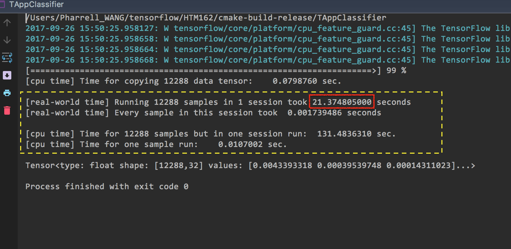
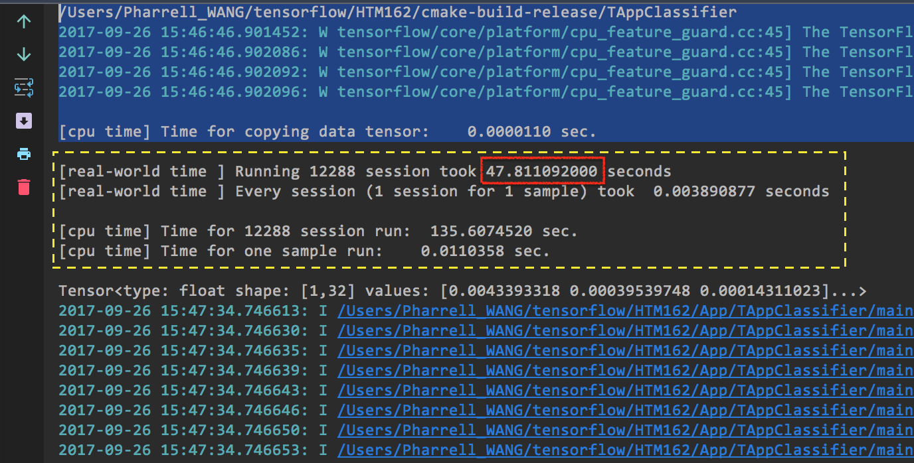
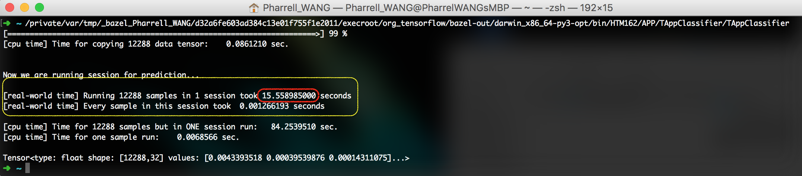
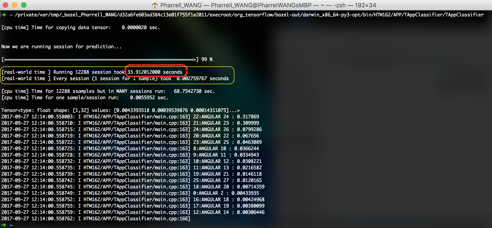
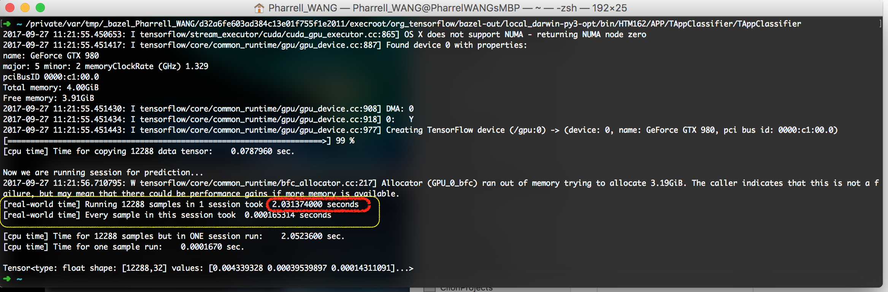
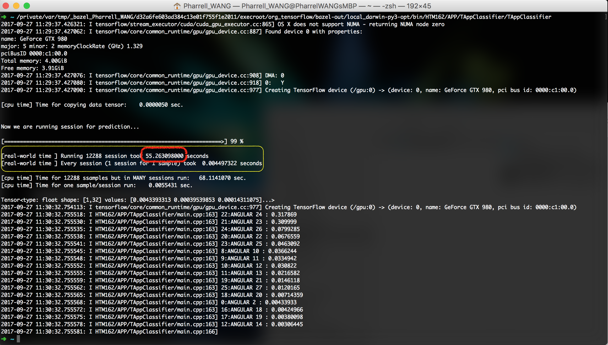

.. _Time-Cost-Analysis:

Time Cost of TF in C++
======================

Motivation
----------

When using Tensorflow(TF) C++ APIs, if you want to run the prediction,
you have to call ``session->Run()``. (When you call the ``session->Run()``,
TF will initialize a session and run the prediction in that session for you.)

We want to know the time cost of ``session->Run()``, since initializing
1 session for 1 block is easier to implement in HTM (It has already
been implemented). But that can be expensive when we talk about time
cost. See experiments for details.

Experiments
-----------
The experiments in this section are performed by loading ResNet graph of
size [16, 16, 32, 64], units 5.

Here we present the experiments for evaluating the time cost
of ``session->Run()``.

Now we want to run predictions for blocks of size 8x8 from a frame in one video sequence.

Total 12288 predictions. (``1024/8*768/8=12288``)

Session Run
~~~~~~~~~~~
Now we only use normal CPU computing, which means our binary is not compiled
with the AVX and SSE4.2 offered by Intel CPU. (AVX and SSE4.2 are CPU
infrastructures for faster matrix computations)

Two choices:

1. Running all samples from one video frame in one session (:ref:`figure1`)
2. Running one sample in one session (:ref:`figure2`)

.. _figure1:

   Figure 1. Running all samples in one session

.. _figure2:

   Figure 2. Running one sample in one session

Look at the time cost.

   +----+----------------------------------------+------------+---------------------------------+
   | #  | Scenario                               | Time Cost  | the difficulty of implementation|
   +====+========================================+============+=================================+
   | 1  | Init one  session  for many block      |   21.37 s  |   not intuitive                 |
   +----+----------------------------------------+------------+---------------------------------+
   | 2  | Init many sessions for many blocks     |   47.81 s  |   intuitive                     |
   +----+----------------------------------------+------------+---------------------------------+

Session Run with AVX, AVX2, SSE4.2
~~~~~~~~~~~~~~~~~~~~~~~~~~~~~~~~~~
Now we are only using the benefits offered by CPU.

Two choices:

1. Running all samples from one video frame in one session (:ref:`figure3`)
2. Running one sample in one session (:ref:`figure4`)

.. _figure3:

   Figure 3. Running all samples in one session

.. _figure4:

   Figure 4. Running one sample in one session

Look at the time cost.

   +----+----------------------------------------+------------+---------------------------------+
   | #  | Scenario                               | Time Cost  | the difficulty of implementation|
   +====+========================================+============+=================================+
   | 1  | Init one  session  for many block      |   15.56 s  |   not intuitive                 |
   +----+----------------------------------------+------------+---------------------------------+
   | 2  | Init many sessions for many blocks     |   33.91 s  |   intuitive                     |
   +----+----------------------------------------+------------+---------------------------------+

Session Run with AVX, AVX2, SSE4.2 and GPU Support
~~~~~~~~~~~~~~~~~~~~~~~~~~~~~~~~~~~~~~~~~~~~~~~~~~

Now we are using both the benefits offered by CPU and GPU.

Two choices:

1. Running all samples from one video frame in one session (:ref:`figure5`)
2. Running one sample in one session (:ref:`figure6`)

.. _figure5:

   Figure 5. Running all samples in one session

.. _figure6:

   Figure 6. Running one sample in one session

Look at the time cost.

   +----+----------------------------------------+------------+---------------------------------+
   | #  | Scenario                               | Time Cost  | the difficulty of implementation|
   +====+========================================+============+=================================+
   | 1  | Init one  session  for many block      |  **2.03** s|   not intuitive                 |
   +----+----------------------------------------+------------+---------------------------------+
   | 2  | Init many sessions for many blocks     |   55.26 s  |   intuitive                     |
   +----+----------------------------------------+------------+---------------------------------+

Conclusions
-----------

Now I put the three tables above together for comparison:

Plain CPU Config
~~~~~~~~~~~~~~~~

   +----+----------------------------------------+------------+---------------------------------+
   | #  | Scenario                               | Time Cost  | the difficulty of implementation|
   +====+========================================+============+=================================+
   | 1  | Init one  session  for many block      |   21.37 s  |   not intuitive                 |
   +----+----------------------------------------+------------+---------------------------------+
   | 2  | Init many sessions for many blocks     |   47.81 s  |   intuitive                     |
   +----+----------------------------------------+------------+---------------------------------+

Employing AVX, SSE4.2
~~~~~~~~~~~~~~~~~~~~~

   +----+----------------------------------------+------------+---------------------------------+
   | #  | Scenario                               | Time Cost  | the difficulty of implementation|
   +====+========================================+============+=================================+
   | 1  | Init one  session  for many block      |   15.56 s  |   not intuitive                 |
   +----+----------------------------------------+------------+---------------------------------+
   | 2  | Init many sessions for many blocks     |   33.91 s  |   intuitive                     |
   +----+----------------------------------------+------------+---------------------------------+

Employing AVX, SSE4.2 and GPU(Parallel computing)
~~~~~~~~~~~~~~~~~~~~~~~~~~~~~~~~~~~~~~~~~~~~~~~~~

   +----+----------------------------------------+------------+---------------------------------+
   | #  | Scenario                               | Time Cost  | the difficulty of implementation|
   +====+========================================+============+=================================+
   | 1  | Init one  session  for many block      |  **2.03** s|   not intuitive                 |
   +----+----------------------------------------+------------+---------------------------------+
   | 2  | Init many sessions for many blocks     |   55.26 s  |   intuitive                     |
   +----+----------------------------------------+------------+---------------------------------+

Apparently, the fastest way is **running a large batch of predictions in a single session using GPU**.

Further more, consider this situation:

- 300 frames to process.
- 12288 8x8 blocks for 1 frame. Time cost 2.03 s for such a frame.
- Then, do a calculation:

      >>> 300 * 2.03 / 60
      10.149999999999999 minutes

That is to say, 10 minutes for a video sequence of 300 frames
only for processing size 8x8 blocks

We also want to do predictions for size 16x16 and 32x32. Hence the time cost are
roughly 30 ~ 60 minutes.
