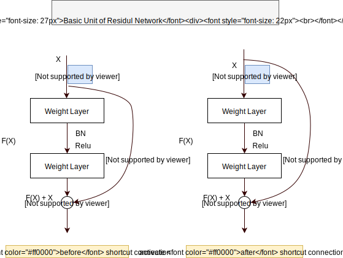
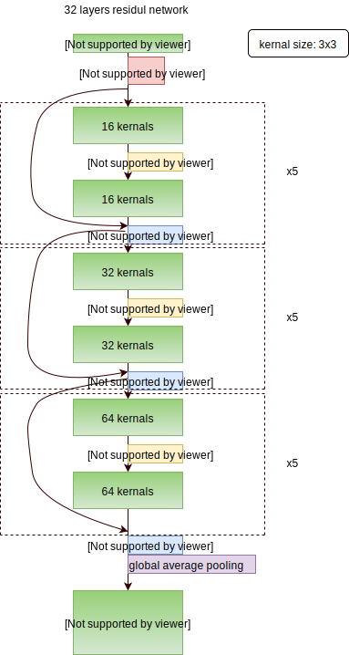
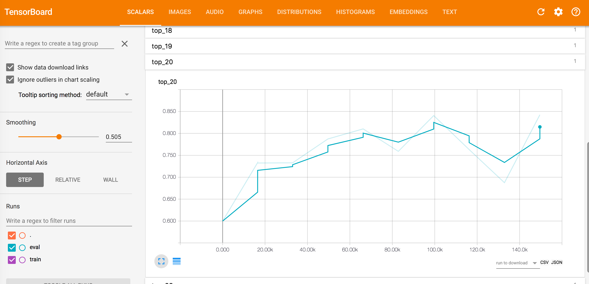
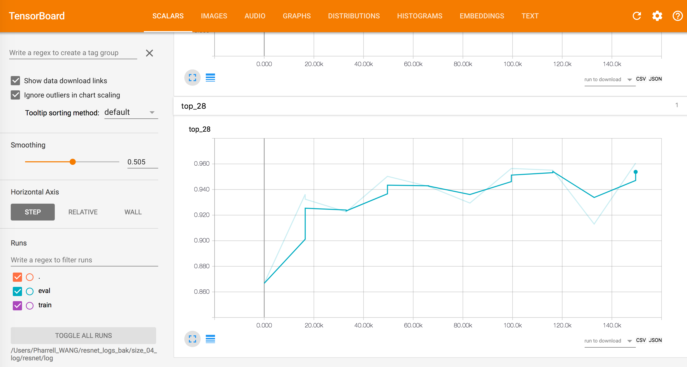
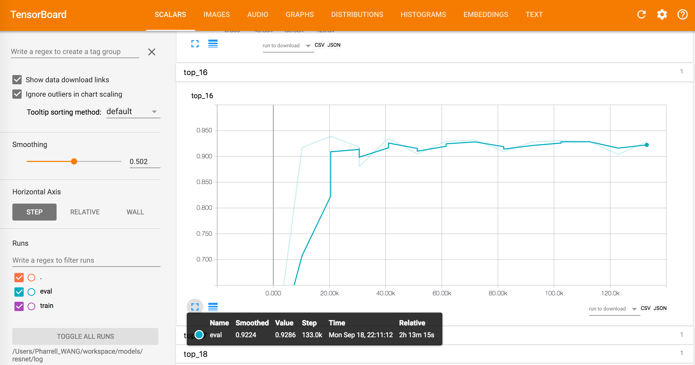
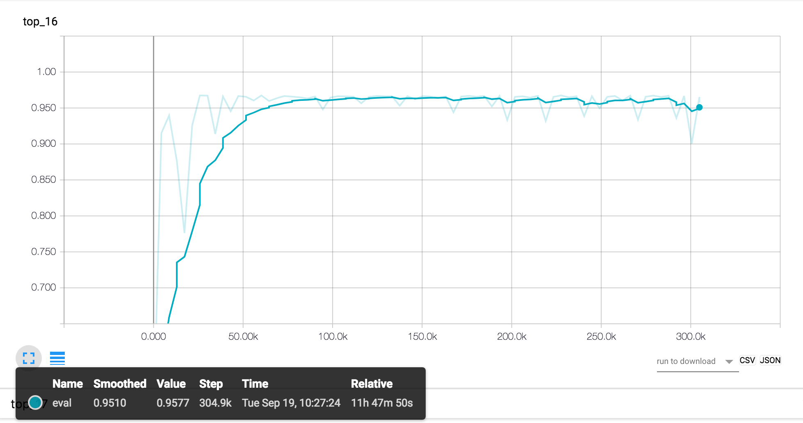

Deep Learning
=============

Download codebase from GitHub: https://github.com/PharrellWANG/fdc_resnet_v3

Convolutional Neural Network
----------------------------

.. figure:: _static/cnn_illustration.svg
   :width: 800px
   :alt: CNN illustration

   Figure 1: Convolutional Neural Networks

   Figure 2: Basic Unit of ResNet

   Figure 3: Our Neural Network Structure

Settings
--------

- All the models are trained from scratch.
- Since the datasets for block size 32x32 and size 64x64 are too small, models are not trained for them. Instead, we use Bilinear Interpolation to resize the block to do the prediction for them using learned model for block size 16x16.

1. No padding/cropping/flipping applied. No data augmentation applied. The orignal data is distorted enough by nature. See :ref:`data-visu` section to get a taste.
2. Momentum optimizer 0.9.
3. Learning rate schedule: 0.01 (<20k), 0.001 (<40k), 0.0001 (<60k), 0.00001 (else).
4. Weight decay rate: 0.0002.
5. Batch size 128.
6. Filters [16, 16, 32, 64], residual units for last three layers: 5

.. note::
        1. Block size 4x4 is for **PU**, while the smallest size of **CU** is 8x8.
        2. From below training results, our model is not so applicable to blocks of size 4x4.
        3. DMM is not applied for size 64x64.

        Our **deep learning** strategy is targeted to **CU** from **size 8x8** to **size 64x64**,
        both *texture* and *depth*.

Training for block size 4x4
---------------------------

Results
~~~~~~~
The model **cannot** learn well for size 4x4, only top-28 is fine.

   Figure 1.1 Top 20 Accuracy

   Figure 1.2 Top 28 Accuracy

Training for block size 8x8
---------------------------

Results
~~~~~~~
The model indeed **can** learn something for size 8x8. Top 16 is fine, which can
reduce the angular modes by half.

   Figure 2.1 Top 16 Accuracy for block size 08x08

Training for block size 16x16
-----------------------------

Results
~~~~~~~
The model indeed **can** learn something for size 16x16. Top 16 is fine, which can
reduce the angular modes by half.

   Figure 2.1 Top 16 Accuracy for block size 16x16

Training for block size 32x32
-----------------------------
Dataset obtained after pre-processing is too small for using deep learning
to train a model. We use Bilinear Interpolation to resize the block to
employ model trained for size 16x16.

Training for block size 64x64
-----------------------------
Dataset obtained after pre-processing is too small for using deep learning
to train a model. We use Bilinear Interpolation to resize the block to
employ model trained for size 16x16.
